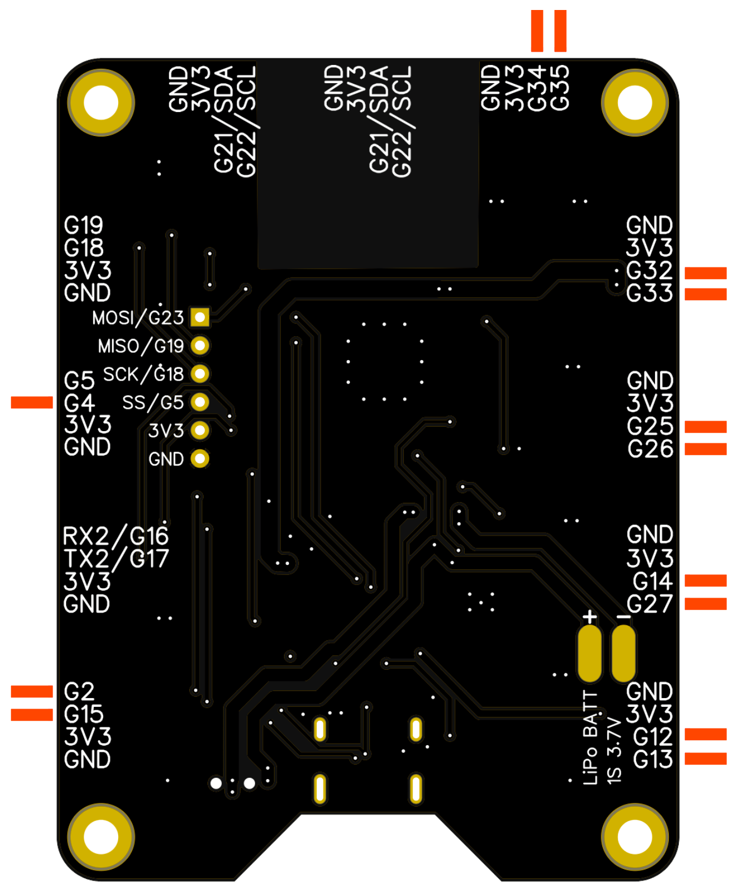

# ML042 Figma Library

Library to control a Figma project using the ML042 board.


## ML042 pinout



| PIN | Analog | Other functions |
| --- | ------ | --------------- |
| G2  | yes    | -               |
| G4  | yes    | -               |
| G5  | no     | -               |
| G12 | yes    | -               |
| G13 | yes    | -               |
| G14 | yes    | -               |
| G15 | yes    | -               |
| G16 | no    | -               |
| G17 | no    | -               |
| G18 | no    | -               |
| G19 | no    | -               |
| G21 | no    | I2C (SDA)       |
| G22 | no    | I2C (SCL)        |
| G25 | yes    | -               |
| G26 | yes    | -               |
| G27 | yes    | -               |
| G32 | yes    | -               |
| G33 | yes    | -               |
| G34 | yes    | -               |
| G35 | yes    | -               |

## Include Library
```cpp
#include <ML042FigmaLib.h>
```

## FigmaButton

```cpp
FigmaButton button(2, 'b'); // pin, key

void setup() {
  Serial.begin(115200);
}

void loop() {
  
  button.update();  // mandatory! Update the button status
  
  // button off
  if(button.off()) Serial.println("Button off");

  // button pressed
  else if(button.pressed()) Serial.print("Button pressed, key: " + String(button.key()));

  // button on
  else if(button.on()) Serial.println("Button on");

  // button released
  else if(button.released()) Serial.println("Button released");

  delay(100);
}
```

## FigmaPot

```cpp
// constructor 1, mapped potentiometer: pin, positions, spread
FigmaPot pot_mapped(13, 4, 200); 

// constructor 2, simple pot without any key functions
FigmaPot pot_simple(2);  

char pot_mapped_last_position = '-';

void setup() {

  Serial.begin(115200);

  // Mapped potentimeter: add the positions
  pot_mapped.addPosition(1, 512, 'A');
  pot_mapped.addPosition(2, 1536, 'B');
  pot_mapped.addPosition(3, 2560, 'C');
  pot_mapped.addPosition(4, 3583, 'D');

}

void loop() {

  // Simple potentiometer
  Serial.println("Simple pot value: " + String(pot_simple.getValue()));

  // Mapped potentiometer
  Serial.println("Mapped pot value: " + String(pot_mapped.getValue()));

  if(pot_mapped.changed()) {
    Serial.print("-> New position: ");
    pot_mapped_last_position = pot_mapped.key();
    Serial.println(pot_mapped_last_position);
  }
  else Serial.println("Old position: " + String(pot_mapped_last_position));

  delay(100);
}
```

### Mapping the values for the potentiometer for addPosition()

Considerations to evenly spread the position along the potentiometer range, the calculation is the following:

```cpp
int dac = 4096; // maxiumum DAC value

for(int id=1; id<=pos; id++ ) {
    dac/pos * (1/2 + (id-1));
}
```
Table with some calculated values 


## FigmaLightSensor

```cpp
FigmaLightSensor sensor(13);

byte old_key = ' ';

void setup() {

    Serial.begin(115200);
    sensor.triggerThreshold(512, 100, 'a', 'b');
}

void loop() {

    // read the sensor
    sensor.update();

    Serial.println("Sensor value" + String(sensor.getValue()));

    if(sensor.changed()) {
    byte current_key = sensor.key();

    if(old_key != current_key) {
        Serial.println("New key: " + String(current_key));
        old_key = sensor.key();
        }
    }

    delay(100);
}
```

## FigmaSwitch

```cpp
// Important! Don't use "switch" as a variable name, because it is already reserved as switch() function

FigmaSwitch rocket_switch(2, 'L', 'R');  // pin, key position 1, key position 2

void setup() {
  Serial.begin(115200);

  Serial.print("Switch initial position: " + String(rocket_switch.position()));
  Serial.println(", key: " + String(rocket_switch.key()));
}

void loop() {

  // Mandatory! Update the switch status at every loop
  rocket_switch.update();

  if(rocket_switch.changed()) {
    Serial.println("\nSwitch changed!");
    Serial.print("Switch position: " + String(rocket_switch.position()));
    Serial.println(", key: " + String(rocket_switch.key()));
  }

  delay(20);
}
```

## FigmaLed

```cpp
FigmaLed led(23);

void setup() {
  Serial.begin(115200);
}

void loop() {

  // LED on
  Serial.println("Led on");
  led.on();
  delay(1000);

  // LED off
  Serial.println("Led off");
  led.off();
  delay(1000);

  // Invert the LED status
  Serial.println("Led toggle");
  led.toggle();
  delay(1000);

  // Invert the LED status
  Serial.println("Led toggle");
  led.toggle();
  delay(1000);

}
```

## FigmaLedPWM

```cpp
FigmaLedPWM led(23, 128, true); // pin, initial value (0-255), on at startup

void setup() {
  Serial.begin(115200);

  Serial.println("Start...");
  delay(2000);
}

void loop() {

  // LED off
  Serial.println("Led off");
  led.off();
  delay(2000);

  // LED on at new value
  Serial.println("Led on at new value (50)");
  led.on(50);
  delay(2000);

  // LED off
  Serial.println("Led off");
  led.off();
  delay(2000);

  // LED on at previous value
  Serial.println("Led on at previous value (50)");
  led.on();
  delay(2000);

  // LED on at new value
  Serial.println("Led on at new value (255)");
  led.on(255);
  delay(2000);
}
```
